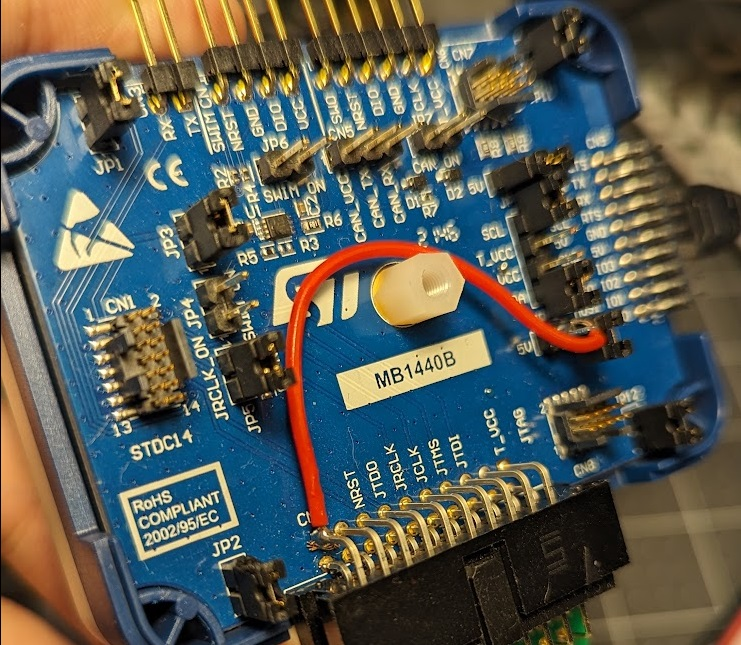

# `grapple-bundle`
[](https://crates.io/crates/grapple-bundle)
[](https://docs.rs/grapple-bundle)

Grapple's Embedded Firmware Bundling Tool

# Flashing Grapple Devices
## Hardware Requirements
Flashing Grapple devices (as they are flashed from the factory, i.e. without GrappleHook or if you are wishing to replace the bootloader) requires an ST-Link v3 with the additional interface board (as found in the [STLINK-V3SET](https://www.digikey.com/en/products/detail/stmicroelectronics/STLINK-V3SET/9636028)). For most devices, you will also require a [TagConnect TC2050-NL probe](https://www.digikey.com.au/en/products/detail/tag-connect-llc/TC2050-IDC-NL/2605367) and a [TC2050-ARM2010 adapter](https://www.digikey.com.au/en/products/detail/tag-connect-llc/tc2050-arm2010/3528170).

Most Grapple devices can be powered by the debug probe itself, however this requires a small modification to the STLINK-V3 and the configuration of a solder bridge on the TC2050-ARM2010 adapter. On the TC2050-ARM2010 adapter, the solder bridge on the right-hand side of the underside of board must be configured for +5V. Additionally, the ST-LINK V3 must have a jumper soldered from any +5V supply to Pin 19 on the ARM2010 adapter to supply power to the target.

_NOTE: Some devices require too much power to be powered by the debug probe and must be given a V+ supply before they can be flashed._



## Installing Rust
Install Rust via rustup by following the instructions here: https://www.rust-lang.org/tools/install

_NOTE: if you are running on Windows and wish to flash devices, you must install Rust in Windows, not WSL, in order to access the probe_

## Installing `grapple-bundle`
To install Grapple bundle, clone the repository (`git clone https://github.com/GrappleRobotics/bundle.git`) and run `cargo install --path .`

## Flashing the Bootloader and Firmware
To flash the Bootloader and Firmware to a target device, run the following command:

```
grapple-bundle flash --chip YOUR_CHIP_MODEL MY_BUNDLE.grplbndl
```

For example, for the LaserCAN:

```
grapple-bundle flash --chip STM32F103C8 LaserCAN-VERSION.grplbndl
```

`grapple-bundle` should automatically detect your debug probe (the ST-Link V3) and flash the target device with both the Bootloader and the Firmware. On some targets, such as the LaserCAN, you may need to detach and reattach the debug probe in order for the firmware to start for the first time.

